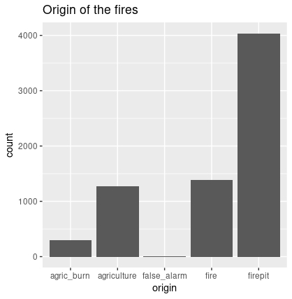

```{r setup, include=FALSE}
knitr::opts_chunk$set(echo = TRUE)
fires <- read.csv('fires2015_train.csv',na.strings="-")
```

## Introdução
Nos dias de hoje, os incêndios florestais têm um forte impacto no nosso planeta destruindo milhares de hectares de floresta por ano, chegando a matar muitas espécies (podendo levar à sua extinção). Estes incêndios podem ter diferentes causas: naturais, acidentes humanos ou causados intencionalmente.
Consideremos Data Mining o processo de explorar grandes quantidade de dados à procura de padrões consistentes. Percebemos então que, através da análise das condições atmosféricas, é possível criar um modelo capaz de prever as causas de incêndios e, assim, melhorar a tomada de medidas preventivas para evitar tragédias.

## Definição do problema

O objetivo deste trabalho é construir um modelo de machine learning capaz de prever as causas dos fogos florestais em 2015.  
O trabalho foi feito na linguagem R.

## Task 1 - Data importation, clean-up and pre-processing

Nesta parte do trabalho, o nosso foco foi tornar o dataset mais simples de analisar.  
Para isso, foi necessário remover certos atributos, assim como fazer pré-processamento de dados.  

  
O primeiro passo foi **remover** atributos desnecessários:

 - **firstInterv_date** e **firstInterv_hour** estes atributos referem-se à data e hora da primeira intervenção pelos bombeiros contra o fogo florestal. Não é um atributo relevante, uma vez que não interfere com a causa de incêndio que estamos a tentar prever.

 - **alert source** este atributo aparece com todos os valores como **NA**, logo, não tem importância nenhuma pra o resultado.
 
 - **extinction_date** e **extinction_hour** estes atributos são relativos à hora e data de extinção do incêndio, algo que não é relativo à origem do incêndio.
 
Os restantes atributos decidimos deixar, uma vez que são **necessários**. Estes atributos são:
 
 - **id** este atributo é necessário, uma vez que é um atributo único para identificar os diferentes registos, do tipo **int**.
 
 - **region, district, municipality** e **parish** estes atributos são relativos à região, distrito, município e freguesia, sendo importantes para localizar o fogo, o que pode ser importante para o nosso estudo. Estes atributos são todos do tipo **factor**
 
 - **lat** e **lon** estes atributos são também relativos à localização, o que os torna importantes. Neste caso, os atributos são do tipo **char**.
 
 - **origin** é um atributo relativo à origem do incêndio, do tipo **factor**.
 
 - **alert_date** e **alert_hour** é a data e a hora do alerta do incêndio, do tipo **factor**.
 
 - **vilage_area, vegetation_area** e **farming_area** estes atributos são relativos à área de região habitável, área de vegetação e área de cultivação, respetivamente.
 
 - **vilage_veget_area** este atributo é também relativo a áreas, mas agora somando a área do atributo **village** com o atributo **vegetation**.
 
 - **total_area** relativo à soma de todas as áreas anteriores.
 
 - **cause_type** este é o atributo relevante à causa do incêndio, aquilo que nós queremos prever no nosso modelo de marchine learning.

  
  
Depois de avaliarmos quais os atributos necessários para a nossa pesquisa, verificamos que existem alguns atributos em falta, na região. Esses atributos em falta aparecem com **"-"**, em vez de um nome válido.  
Uma primeira abordagem foi verificar todos os valores para o qual isso acontece, e tentar encontrar atributos iguais em entradas com IDs diferentes para substituir os valores em falta. Um problema que foi verificado nesta abordagem foi o tempo de execução elevado para substituir esses **missing values**.  
Uma segunda abordagem foi remover todos os atributos com os valores em falta.

Outro problema encontrado, foi a inconsitência entre valores dos atributos latitude e longitude visto que existiam datas (por exemplo, em vez de aparecerem coordenadas, apareciam no seu lugar 1900-01-01 14:53:21. Para resolver esse problema, decidimos ignorar a primeira parte, ou seja, 1900-01-01 e usar apenas a segunda, 14:53:21).
Além disso, outra alteração teve de ser aplicada ao dataset, tendo sido necessário modificar os valores da latitude e longitude, que inicialmente estavam no formato de **DMS** (Degrees Minutes Seconds) e passaram para o formato **decimal**. 

Por último, de forma a conseguir uma melhor previsão acrescentamos uma nova coluna com a temperatura máxima (TMAX) conseguida por meio de um script fornecido no enunciado do trabalho, getTemperatureNOAA.R.

## Task 2 - Data exploratory analysis

Esta parte do trabalho envolve sumarizar e visualizar alguns dados que consideramos relevantes e ter perceção de onde os impactos dos fogos florestais foram mais nefastos.


Img1 - Origem dos fogos    | Img2 - Área total queimada 
:-------------------------:|:-------------------------:
           |  


Como é possível verificar a partir da Img1, a origem dos fogos é maioritariamente devido a **firepit** tal como seria de prever, enquanto que se verificaram muito menos registos de fogos causados por **agric_burn**. Em último lugar, tendo o mínimo de ocorrências encontram-se os **false_alarm**. Escolhemos este atributo pelo facto de nos permitir ter uma noção mais nítida de quais são as maiores causas de fogos florestais.

Já na Img2, relativa à **área total queimada**, verifica-se que a região mais afetada pelos fogos foi **Entre Douro e Minho** com quase 12500 de área destruída, enquanto que as regiões menos afetadas foram **Norte**, **Lisboa e Vale do Tejo** e **Algarve** com áreas queimadas muito inferiores. Através destes dois atributos (total de área queimada e região) podemos perceber que existe uma grande discrepância de áreas queimadas entre regiões.


## Task 3 - Predictive modelling

De entre os diversos modelos que poderíamos escolher para a realização da tarefa proposta, ou seja, para a previsão da causa de fogos florestais, o nosso grupo selecionou 3: o modelo **k-Nearest Neighbors**, **Naive Bayes** e **Random Forests**.

O modelo **k-Nearest Neighbors**, destaca-se por ser um algoritmo muito intuitivo e simples, visto que tudo o que precisamos de fazer é comparar amostras.
Outra característica deste algoritmo é que não faz suposições, assim, tendo material e dados suficientes pode ser aplicado a qualquer problema.
Além disso, não requer nenhuma etapa de treino explícita, sendo um aprediz baseado em instância, logo aprende por analogia, tendo como base a noção de semelhança entre casos.


O modelo **Naive Bayes** é por sua vez também ele simples, fácil de implementar e bastante eficaz o que faz dele um bom candidato para a combinação de regras aprendidas, para além de possuir uma velocidade relativamente alta e precisar de poucos dados para realizar a classificação desejada. É indicado para realizar previsões em tempo real.


Mas apesar de incialmente estes algoritmos nos terem chamado à atenção, depois de alguma pesquisa mais aprofundada optamos por escolher o modelo **Random Forests**. Este algoritmo pode ser usado tanto para classificação como para regressão, sendo um dos mais fáceis de usar.
Uma floresta é composta por árvores, e quanto mais árvores tem, mais robusta é a floresta, logo verificamos à priori que este modelo será mais preciso no resultado do que os outros dois modelos referidos acima (k-NN e Naive Bayes),  visto que tem a capacidade de utilizar mais atributos, o que lhe atribuí um único senão, sendo este o facto de demorar mais tempo a terminar. A partir das florestas são criadas árvores de decisão em amostras de dados, obtendo previsões de cada árvore e selecionando a melhor solução.

Existem **4 etapas** de funcionamento pelas quais o algoritmo é submetido:

  - **Seleciona amostras aleatórias** de um determinado conjunto de dados.
  
  - **Constrói uma árvore de decisão** para cada amostra e obtém um resultado de previsão de cada árvore de decisão.
  
  - **Faz uma votação** para cada resultado previsto.
  
  - **Seleciona o resultado** da previsão com mais votos como previsão final.

De entre as várias vantagens inerentes a este algoritmo destacam-se o facto de as florestas aleatórias serem consideradas um método altamente preciso e robusto devido ao número de árvores de decisão que participam do processo além de que podem lidar com valores ausentes substituindo-os por valores medianos computando a média ponderada por proximidade.


Nesta task começamos por selecionar as colunas com atributos relavantes ao treino do nosso modelo, que neste caso foram: região, distrito, latitude, longitude, origem, alert_date, village_area, vegetation_area, farming_area, cause_type.

De seguida, aplicou-se o modelo escolhido ao dataset de teste, tendo como resultado 0,67229. Este resultado foi o melhor quando comparado aos outros dois modelos visto que o k-NN teve como resultado 0,55284  e o Naive Bayes 0,62966.


## Conclusões
Relativamente a melhorias que poderiam ter sido feitas, na parte incial do trabalho, se em vez de termos apagado as linhas que continham missing values na **region** tivessemos estimado os valores de acordo com atributos semelhantes poderiamos ter obtido um melhor desempenho no nosso modelo.
Em suma, este trabalho permitiu-nos conhecer os diferentes modelos existentes e perceber quais os melhores modelos para lidar com diferentes tipos de situações, assim como aprofundar as nossas competências em linguagem R.